# マチョ田の部屋 Mermaid 構成図

最終更新: 2026-07-12

この図は、現在の `macho-website` の主要ページ、API、外部サービス、DB、静的アセットの関係を俯瞰するための構成図です。

```mermaid
flowchart TB
  user[ユーザー / Browser] --> vercel[Vercel<br/>Next.js App Router]

  subgraph next[Next.js アプリ]
    layout[src/app/layout.tsx<br/>共通レイアウト / メタ情報 / 計測タグ]
    home["/<br/>トップページ"]
    blogList["/blog<br/>ブログ一覧"]
    blogDetail["/blog/[id]<br/>ブログ詳細"]
    profile["/profile<br/>プロフィール"]
    menu["/menu<br/>マチョ田の筋トレメニュー"]
    calculator["/intake-calculator<br/>カロリー/たんぱく質計算機"]
    supplements["/supplements-ranking<br/>おすすめサプリ"]
    shoes["/training-wear<br/>おすすめトレーニングシューズ"]
    gear["/training-gear<br/>おすすめトレーニングギア"]
    faq["/training-faq<br/>筋トレFAQ"]
    clicker["/macho-clicker<br/>マチョクリッカー"]
    contact["/contact<br/>お問い合わせ"]
    privacy["/privacy<br/>プライバシーポリシー"]
  end

  vercel --> layout
  layout --> home
  layout --> blogList
  layout --> blogDetail
  layout --> profile
  layout --> menu
  layout --> calculator
  layout --> supplements
  layout --> shoes
  layout --> gear
  layout --> faq
  layout --> clicker
  layout --> contact
  layout --> privacy

  subgraph components[src/components]
    homeComponent[home-page.tsx<br/>トップ導線 / Blog最新表示]
    headerComponent[site-header.tsx<br/>共通ヘッダー]
    supplementsComponent[supplements-top-page.tsx<br/>サプリ表示カード]
    clickerComponent[macho-clicker-page.tsx<br/>ゲーム本体]
  end

  home --> homeComponent
  layout --> headerComponent
  supplements --> supplementsComponent
  clicker --> clickerComponent

  subgraph api[API Route Handlers]
    apiBlogs["/api/blogs<br/>Blog最新取得"]
    apiBlogId["/api/blogs/[id]<br/>Blog詳細取得"]
    apiRevalidate["/api/revalidate<br/>microCMS再検証"]
    apiContact["/api/contact<br/>お問い合わせ送信"]
    apiClicker["/api/macho-clicker/rankings<br/>ゲームランキング"]
    apiCron["/api/cron/protein-rankings<br/>サプリDB更新"]
  end

  homeComponent --> apiBlogs
  blogList --> apiBlogs
  blogDetail --> apiBlogId
  contact --> apiContact
  clickerComponent --> apiClicker

  subgraph lib[src/lib]
    seoLib[seo.ts<br/>SEO定義]
    supabaseLib[supabase/*<br/>Supabase client]
    rankingLib[protein-rankings/*<br/>楽天取得 / 抽出 / 保存 / リンク生成]
    priceLib[rakuten-price.ts<br/>楽天参考価格取得]
  end

  layout --> seoLib
  apiClicker --> supabaseLib
  apiCron --> rankingLib
  rankingLib --> supabaseLib
  supplementsComponent --> supabaseLib
  shoes --> priceLib
  gear --> priceLib

  subgraph external[外部サービス]
    microcms[microCMS<br/>Blog CMS]
    supabase[(Supabase Postgres)]
    resend[Resend<br/>メール送信]
    rakuten[Rakuten Web Service API]
    rakutenAffiliate[楽天アフィリエイトリンク]
    amazonAffiliate[Amazonアソシエイトリンク]
    iherb[iHerb外部リンク]
    analytics[Google Analytics / Tag Manager / AdSense]
  end

  apiBlogs --> microcms
  apiBlogId --> microcms
  apiRevalidate --> microcms
  supabaseLib --> supabase
  rankingLib --> rakuten
  priceLib --> rakuten
  apiContact --> resend
  layout --> analytics

  supplementsComponent --> rakutenAffiliate
  supplementsComponent --> amazonAffiliate
  supplementsComponent --> iherb
  shoes --> rakutenAffiliate
  shoes --> amazonAffiliate
  gear --> rakutenAffiliate
  gear --> amazonAffiliate

  subgraph db[Supabase テーブル]
    products[products<br/>商品基本情報]
    metrics[product_metrics<br/>抽出指標 / 分類]
    rankings[rankings<br/>サプリ表示ランキング]
    clickerScores[macho_clicker_scores<br/>ゲームランキング]
  end

  supabase --> products
  supabase --> metrics
  supabase --> rankings
  supabase --> clickerScores

  subgraph cron[Vercel Cron]
    cronProtein[毎週日曜 18:00 UTC<br/>/api/cron/protein-rankings]
    cronShoes[毎週日曜 18:10 UTC<br/>/training-wear 再検証]
    cronGear[毎週日曜 18:20 UTC<br/>/training-gear 再検証]
  end

  cronProtein --> apiCron
  cronShoes --> shoes
  cronGear --> gear

  subgraph publicAssets[public アセット]
    pictures[public/picture<br/>プロフィール / 商品補助画像]
    clickerAssets[public/game/macho-clicker<br/>背景 / アイコン / 進化キャラ / 効果音]
    icons[public/icon.png<br/>favicon]
  end

  home --> pictures
  profile --> pictures
  supplementsComponent --> pictures
  clickerComponent --> clickerAssets
  layout --> icons
```

## 補足

- 画面ルートは `src/app/**/page.tsx`、API は `src/app/api/**/route.ts` に対応しています。
- `/supplements-top3` は旧URL互換用で、現在の表示先は `/supplements-ranking` です。
- サプリDB更新は Vercel Cron から `/api/cron/protein-rankings` を呼び、楽天APIで取得した情報を Supabase に保存します。
- トレーニングシューズとトレーニングギアは静的定義を中心に、楽天URLがある商品の参考価格だけ `rakuten-price.ts` で取得します。
- マチョクリッカーのゲーム進行はブラウザの `localStorage`、ランキングだけ Supabase に保存します。
